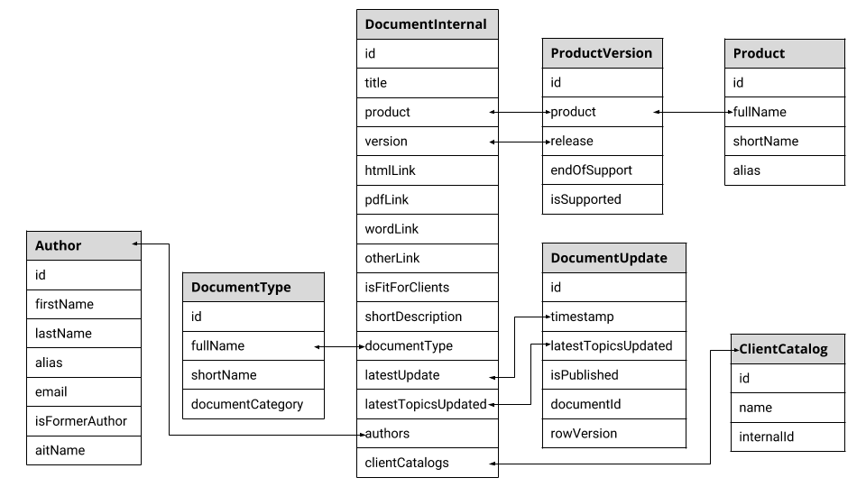

Internal Documents
==================

Internal Documents are the main entry point for portal applications. The ``DocumentInternal`` object consolidates the relevant information from all other entities into a single object. The ``DocumentInternal`` object is then used for displaying the information to internal users (i.e. company employees). 
                 
The available endpoints only support the ``GET`` method to ensure that the information is read-only. For creating, updating and deleting each entity, including documents, please refer to the appropriate section of the document.

.. note:: Some entities have not been described yet. However, you can use the Swagger document to gain a basic insight. For more information, refer to :doc:`../swagger`.

Data Model
^^^^^^^^^^

+---------------------+-------------------+-------------------------------------------------------------+
| Property            | Type              | Description                                                 |
+=====================+===================+=============================================================+
| id                  | integer           | Unique ID of the document.                                  |
|                     |                   |                                                             |
+---------------------+-------------------+-------------------------------------------------------------+
| title               | string            | Title of the document.                                      |
|                     |                   |                                                             |
+---------------------+-------------------+-------------------------------------------------------------+
| product             | string            | Full name of the product associated to the document.        |
|                     |                   |                                                             |
+---------------------+-------------------+-------------------------------------------------------------+
| version             | string            | Name of the product version (release) related to            |
|                     |                   | the document.                                               |
+---------------------+-------------------+-------------------------------------------------------------+
| htmlLink            | string            | Relative path to the HTML output of the document.           |
|                     |                   |                                                             |
+---------------------+-------------------+-------------------------------------------------------------+
| pdfLink             | string            | Relative path to the PDF output of the document.            |
|                     |                   |                                                             |
+---------------------+-------------------+-------------------------------------------------------------+
| wordLink            | string            | Relative path to the Word output of the document.           |
|                     |                   |                                                             |
+---------------------+-------------------+-------------------------------------------------------------+
| otherLink           | string            | Relative path to a miscellaneous output of the document.    |
|                     |                   |                                                             |
+---------------------+-------------------+-------------------------------------------------------------+
| isFitForClients     | boolean           | Determines if the document can be shared with clients.      |
|                     |                   |                                                             |
+---------------------+-------------------+-------------------------------------------------------------+
| shortDescription    | string            | Short description of the document. Used to provide          |
|                     |                   | additional details to the end-users.                        |
+---------------------+-------------------+-------------------------------------------------------------+
| documentType        | string            | Name of the document type related to the document. Used to  |
|                     |                   | provide further classification.                             |
+---------------------+-------------------+-------------------------------------------------------------+
| latestUpdate        | datetime          | Date of the latest published update of the document.        |
|                     |                   |                                                             |
+---------------------+-------------------+-------------------------------------------------------------+
| latestTopicsUpdated | string            | Description of the latest published update of the document. |
|                     |                   |                                                             |
+---------------------+-------------------+-------------------------------------------------------------+
| authors             | array of          | Authors related to the document.                            |
|                     | ``Author``        | For more information, please refer to :doc:`../authors`.    |
|                     | objects           |                                                             |
+---------------------+-------------------+-------------------------------------------------------------+
| clientCatalogs      | array of          | Client catalogs related to the document.                    |
|                     | ``ClientCatalog`` |                                                             |
|                     | objects           |                                                             |
+---------------------+-------------------+-------------------------------------------------------------+

Available Actions
^^^^^^^^^^^^^^^^^

.. toctree::
   :maxdepth: 1   

   get
   get_by_type
   get_by_product
   get_by_version
   search
   get_by_id
   get_updates